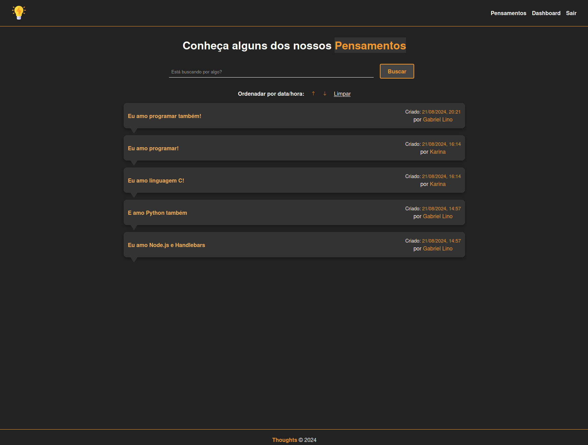

# Thoughts





**Thoughts** é uma aplicação simples em **Node.js** que permite aos usuários autenticados compartilhar, editar e excluir seus pensamentos. Além disso, você pode buscar por título e ordenar os pensamentos por data/hora.

## Funcionalidades

- Autenticação e cadastro de usuários
- Envio de pensamentos
- Edição e exclusão de pensamentos
- Busca de pensamentos por título
- Ordenação de pensamentos por data/hora

## Tecnologias Utilizadas

- [Nodemon](https://nodemon.io/) - Monitoramento automático de mudanças no código
- [Express](https://expressjs.com/) - Framework para Node.js
- [Sequelize](https://sequelize.org/) - ORM para Node.js
- [Express-Handlebars](https://www.npmjs.com/package/express-handlebars) - Motor de template
- [Express-Sessions](https://www.npmjs.com/package/express-session) - Gerenciamento de sessões
- [MySQL](https://www.mysql.com/) - Banco de dados relacional
- [MySQL2](https://www.npmjs.com/package/mysql2) - Driver para Node.js
- [Flash](https://www.npmjs.com/package/express-flash) - Mensagens de feedback

## Como Executar o Projeto

1. Clone este repositório:

   ```bash
   git clone https://github.com/seuusuario/thoughts.git
   ```
2. Instale as dependências:

   ```bash
   cd thoughts
   npm install
   ```
3. Configure o banco de dados no arquivo .env.

4. Inicie a aplicação:
   ```bash
   mpm start
   ```

   [](https://github.com/GLK-7)

